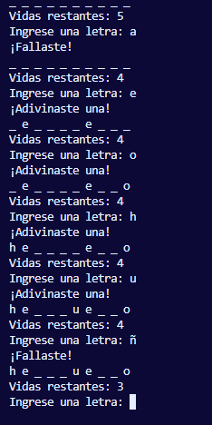

# 😵 Desafío Ahorcado (The Hangman)

**Desafío Ahorcado** es una implementación en consola del clásico juego de adivinanza de palabras. Desarrollado en **Python**, este proyecto pone a prueba la lógica de control de flujo, manejo de cadenas y validación de entradas de usuario.

El objetivo es simple: adivinar la palabra oculta letra por letra antes de que se agoten tus vidas.


## 📸 Demo en Terminal



## 📋 Características del Juego

* **🎲 Aleatoriedad:** Selección automática de palabras desde una lista predefinida usando la librería `random`.
* **🛡️ Validación de Entradas:**
    * El sistema impide ingresar números o símbolos (`isalpha()`).
    * Obliga al usuario a ingresar una sola letra a la vez (`len() != 1`).
* **❤️ Sistema de Vidas:**
    * El jugador comienza con **5 vidas**.
    * Cada error descuenta una vida automáticamente.
* **👁️ Interfaz Visual de Texto:**
    * Se muestra el progreso de la palabra con guiones bajos (`_ _ _ a _ _`).
    * Se actualiza en tiempo real al adivinar correctamente.

## 🛠️ Tecnologías y Conceptos

Este script demuestra el dominio de los fundamentos de Python:

* **Funciones:** Modularización del código (`elegir_palabra`, `validar`, `control_vidas`).
* **Bucles `While`:** Para el ciclo principal del juego y la validación de errores.
* **Listas y Strings:** Manipulación de caracteres y uso de `.join()` para mostrar el tablero.
* **Control de Flujo:** Uso de `break` para terminar el juego al ganar.

## 🧠 Flujo del Juego

```mermaid
graph TD;
    A[Inicio] --> B{Tiene Vidas?};
    B -- Si --> C[Mostrar Tablero];
    C --> D[Pedir Letra];
    D --> E{Es válida?};
    E -- No --> D;
    E -- Si --> F{Está en la palabra?};
    F -- Si --> G[Revelar Letra];
    F -- No --> H[Restar Vida];
    G --> I{Completó la palabra?};
    H --> B;
    I -- No --> B;
    I -- Si --> J[¡GANASTE!];
    B -- No --> K[GAME OVER];
